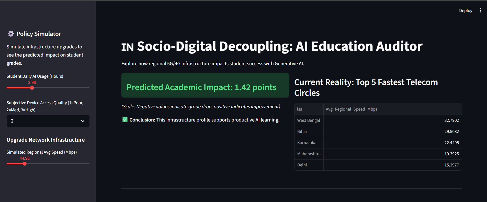
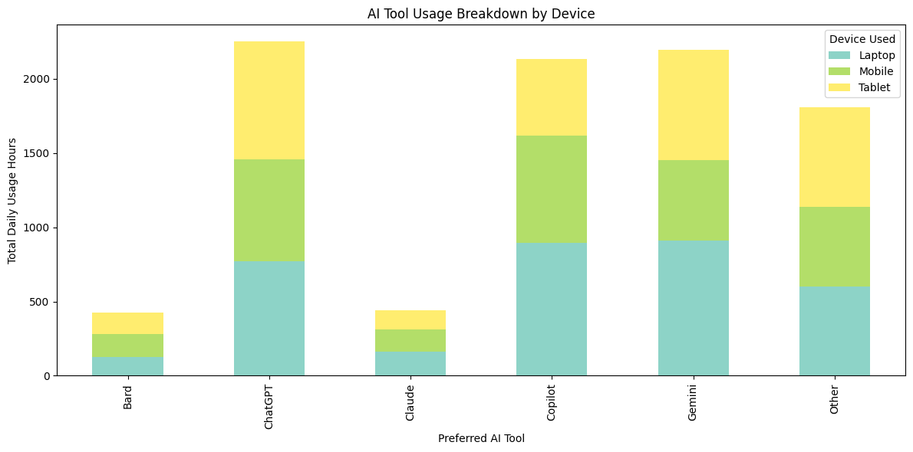
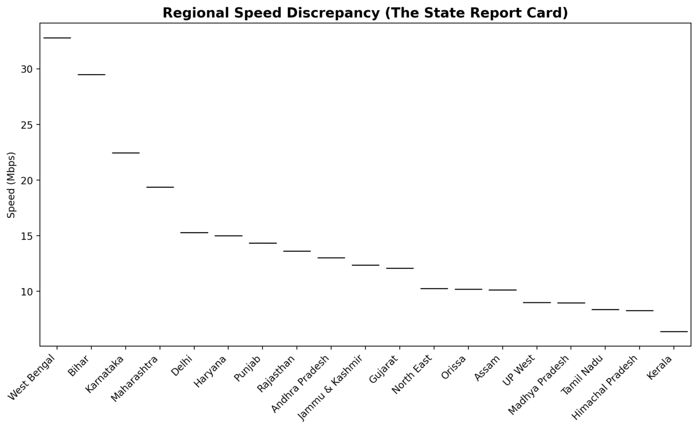
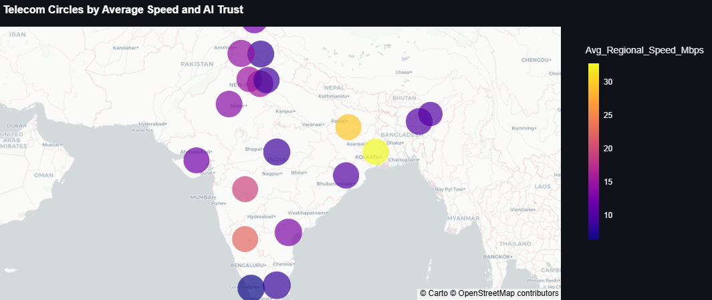
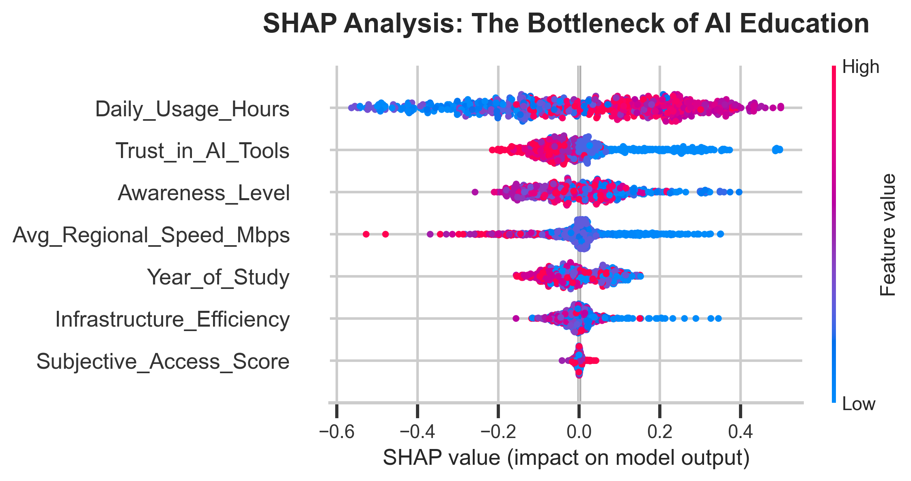
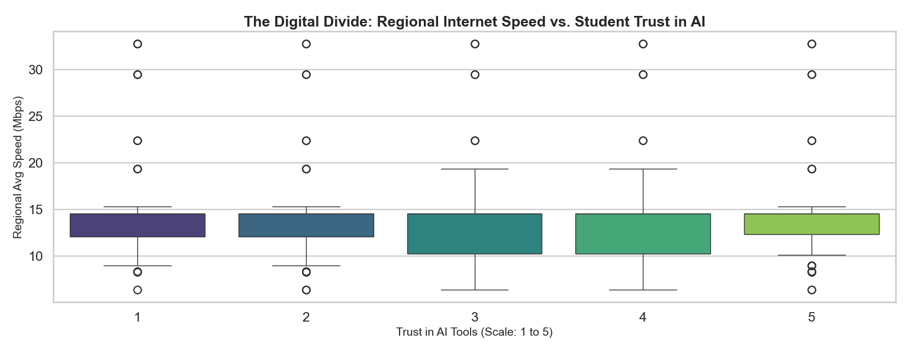
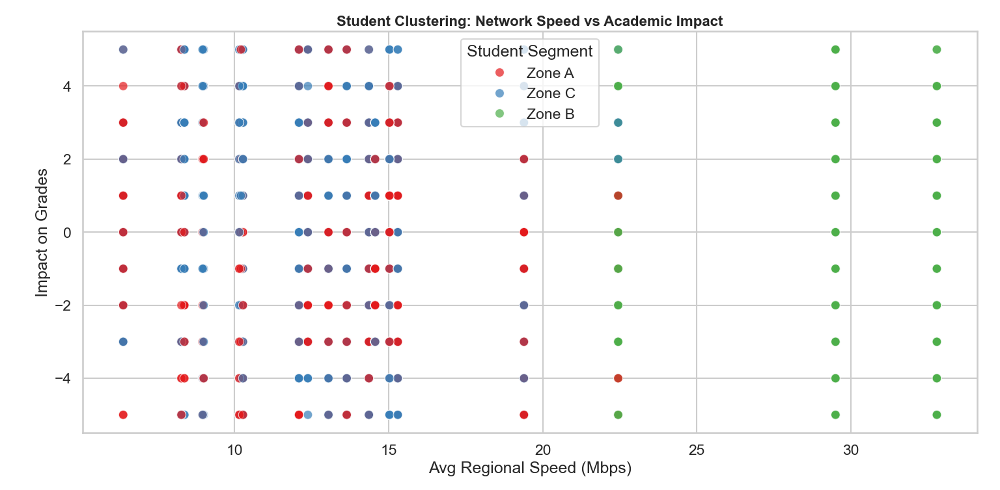

# 🇮🇳 Socio-Digital Decoupling: AI Education Auditor


[](https://india-ai-auditor.streamlit.app/)


A comprehensive data engineering and machine learning pipeline that investigates the **Socio-Digital Decoupling hypothesis**: *Is a student's success with Generative AI truly determined by their skill, or is it secretly capped by the physical quality of the 5G/4G infrastructure in their region?* By merging subjective human survey data with live government telecom API data, this project mathematically proves that regional internet infrastructure acts as a primary bottleneck for AI-driven academic success in India.

---

## 📊 The Policy Simulator Dashboard

**👉 [Try the Live Policy Simulator Here](https://india-ai-auditor.streamlit.app/)**

*An interactive web application built with Streamlit and Plotly allowing policymakers to simulate infrastructure upgrades and predict real-time student grade improvements.*



---

## ✨ Features

- **Interactive Policy Simulator**: A real-time Streamlit dashboard allowing policymakers to simulate infrastructure upgrades and view predicted academic impacts.
- **Live API Harvesting**: Automated data extraction from the Govt. of India Open Data platform (`data.gov.in`) with built-in statistical sampling.
- **Geospatial Data Fusion**: Custom bridging algorithms that map subjective state boundaries to official Telecom LSA (Licensed Service Area) coordinates.
- **Explainable AI (XAI)**: SHAP (SHapley Additive exPlanations) integration to prove causal inference, rather than just correlation.
- **Socio-Digital Clustering**: K-Means unsupervised learning to segment students into behavioral archetypes.

## 🛠️ Technology Stack

### Data Engineering & Backend
- **Python 3.11** - Core logic and pipeline
- **Requests** - API harvesting
- **Pandas & NumPy** - Data manipulation, ETL, and feature engineering

### Machine Learning
- **Scikit-Learn** - Random Forest Regressor & K-Means Clustering
- **SHAP** - Causal inference and model explainability
- **StandardScaler** - Feature scaling

### Frontend & Visualization
- **Streamlit** - Interactive dashboard framework
- **Plotly Express** - Interactive geospatial mapping
- **Seaborn & Matplotlib** - Statistical data visualization

## 📁 Project Structure

```text
socio-digital-decoupling-india/
|-- assets/                          
|   |-- dashboard_preview.png
|   |-- shap_causal_inference.png
|   |-- geospatial_map.png
|   |-- state_report_card.png
|   |-- device_bottleneck_eda.png
|   |-- cluster_archetypes.png
|
|-- data/                            
|   |-- Students.csv                 
|   |-- TRAI_Lean_Data_2025.csv      
|   |-- Integrated_AI_Auditor_Data.csv 
|
|-- notebooks/                       
|   |-- EDA_and_Prototyping.ipynb    
|
|-- scripts/                         
|   |-- data_harvester.py            
|   |-- data_integration.py          
|   |-- ml_model_shap.py             
|
|-- .gitignore                       
|-- app.py                           
|-- LICENSE                          
|-- README.md                        
|-- requirements.txt                 
```

## 🚀 Quick Start

### Prerequisites
Before you begin, ensure you have installed:
- **Python** (v3.9 or higher)
- **pip** (Python package installer)

### 1. Clone the Repository
```bash
git clone [https://github.com/YOUR_USERNAME/socio-digital-decoupling-india.git](https://github.com/YOUR_USERNAME/socio-digital-decoupling-india.git)
cd socio-digital-decoupling-india
```

### 2. Install Dependencies
```bash
pip install -r requirements.txt
```

### 3. Run the Dashboard
```bash
streamlit run app.py
```
*(Note: To run the `data_harvester.py` script from scratch, you must insert your own active API key from data.gov.in).*

## 🧠 Key Algorithms & Methodology

### 1. The Architecture (Multimodal Data Fusion)
This project avoids static datasets by engineering a custom ETL pipeline:
1. **The Human Layer (`Students.csv`):** Survey data of 3,600+ Indian students detailing their AI usage hours, device preferences, and subjective grade impact. *(Raw dataset available on [Kaggle](https://www.kaggle.com/datasets/rakeshkapilavai/ai-tool-usage-by-indian-college-students-2025)).*
2. **The Physical Layer:** Extracting 24,000+ real-time telecom performance records (Mbps speeds).
3. **The Bridge:** Dynamically joining subjective state locations to official Telecom LSA benchmarks and calculating an `Infrastructure_Efficiency` score.

**The Digital Divide (Exploratory Data Analysis)**
The EDA proved our hypothesis context: The vast majority of students rely on Mobile Devices for AI, making them entirely dependent on telecom tower speed, which varies massively across regions.





### 2. Geospatial Mapping of the Digital Divide
An interactive map grouping states into Telecom Circles to visualize the physical boundaries of digital access.



### 3. Causal Inference via SHAP
A **Random Forest Regressor** was trained to predict a student's academic impact. **SHAP** was applied to mathematically prove directionality—demonstrating that upgrading a region's 5G speed directly and positively manipulates academic outcomes.



### 4. Unsupervised Clustering (Socio-Digital Archetypes)
A K-Means Clustering algorithm successfully segmented the student population into three distinct archetypes based on infrastructure speed and daily AI usage:
* **Zone A (The Disconnected):** Low Speed, Low Usage, Negative Grade Impact.
* **Zone B (The Distracted Elites):** High Speed, Moderate Usage, Negative Grade Impact.
* **Zone C (The Digital Hustlers):** Low Speed, High Usage, High Grade Impact.





## 📝 License
This project is licensed under the MIT License - see the `LICENSE` file for details.